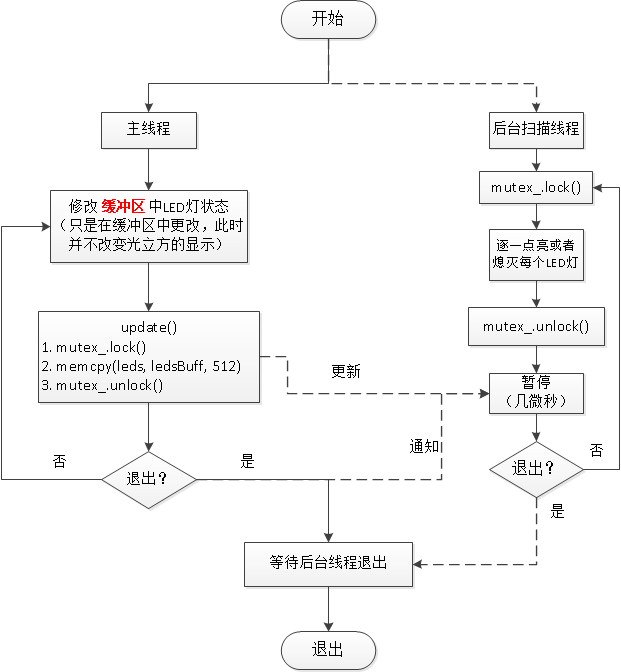
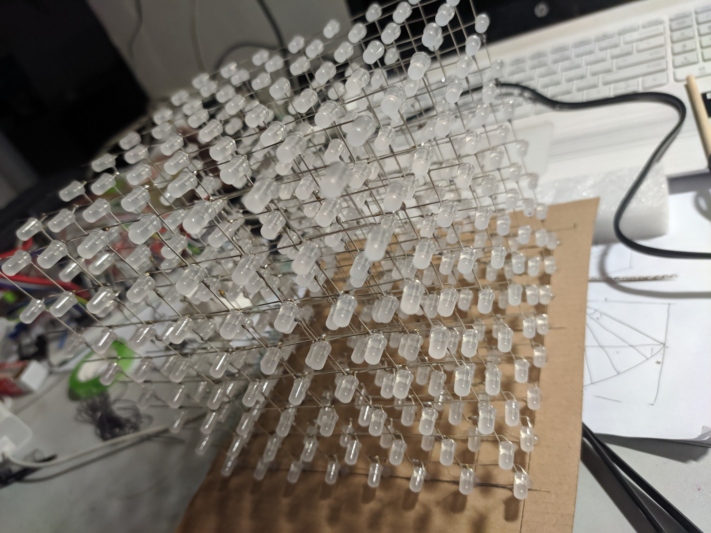
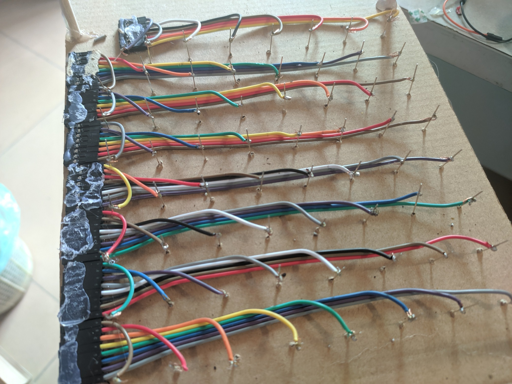
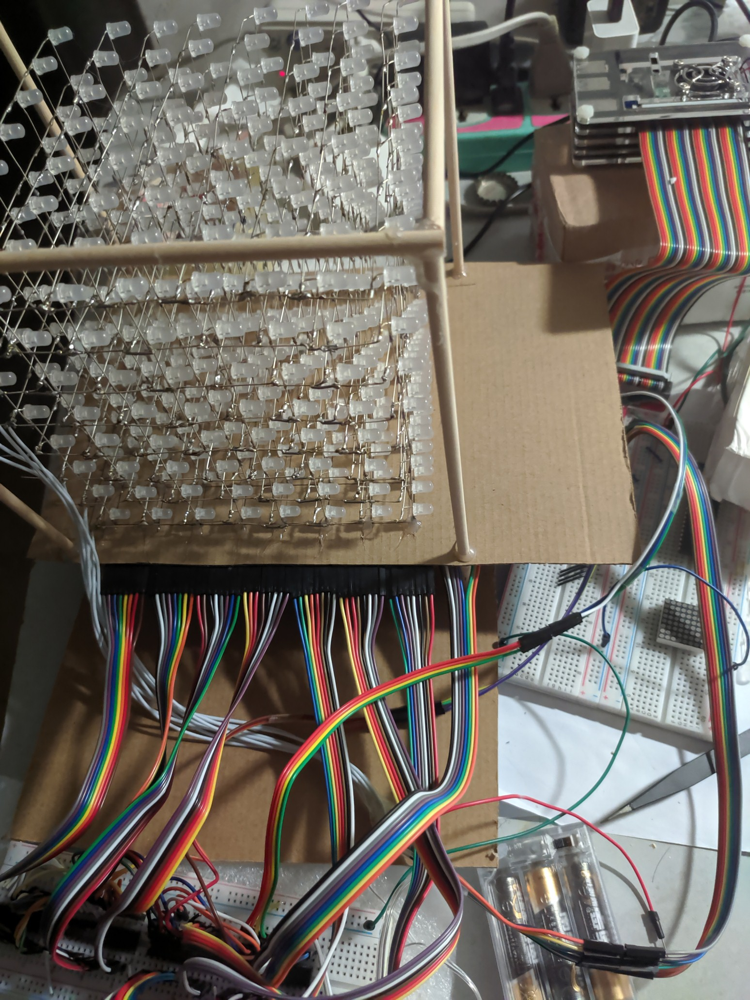
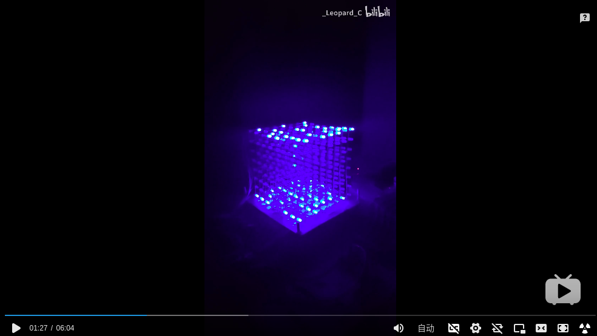

## LED CUBE. (Driven by RaspberryPi and 74HC154 chip)

【驱动程序   +   20多种特效】


## 一、仓库目录结构

```bash
├── effects_list
│   ├── group
│   │   └── fireworks.eml
│   ├── list.eml         # 自定义的文件类型（.eml），描述每种特效的参数
│   └── script
│       └── script1
├── led_cube             # 可执行程序
├── README.md
├── src                  # 源码
│   ├── driver
│   │   ├── cube.cpp
│   │   ├── cube_extend.cpp
│   │   ├── cube_extend.h
│   │   ├── cube.h         # 核心类（驱动光立方）
│   │   ├── script.cpp
│   │   ├── script.h
│   │   ├── x_74hc154.cpp
│   │   └── x_74hc154.h
│   ├── effect              # 特效目录（一种特效对应一个类）
│   │   ├── breath_cube.cpp
│   │   ├── breath_cube.h
│   │   ├── cube_size_from_inner.cpp
│   │   ├── cube_size_from_inner.h
│   │   ├── cube_size_from_vertex.cpp
│   │   ├── cube_size_from_vertex.h
│   │   ├── drop_line.cpp
│   │   ├── drop_line.h
│   │   ├── drop_point.cpp
│   │   ├── drop_point.h
│   │   ├── drop_text_point.cpp
│   │   ├── drop_text_point.h
│   │   ├── effect.h                 # 所有特效类的基类
│   │   ├── fireworks_from_center.cpp
│   │   ├── fireworks_from_center.h
│   │   ├── function_graph.cpp
│   │   ├── function_graph.h
│   │   ├── layer_scan.cpp
│   │   ├── layer_scan.h
│   │   ├── random_drop_point.cpp
│   │   ├── random_drop_point.h
│   │   ├── random_height.cpp
│   │   ├── random_height.h
│   │   ├── random_light.cpp
│   │   ├── random_light.h
│   │   ├── rise_and_fall
│   │   ├── snake.cpp
│   │   ├── snake.h
│   │   ├── text_scan.cpp
│   │   ├── text_scan.h
│   │   ├── wander_edge.cpp
│   │   ├── wander_edge.h
│   │   ├── wander_edge_join_auto_inc.cpp
│   │   ├── wander_edge_join_auto_inc.h
│   │   ├── wander_edge_join.cpp
│   │   └── wander_edge_join.h
│   ├── main.cpp
│   └── utility
│       ├── coordinate.h
│       ├── enum.h
│       ├── ExpressionEvaluator.cpp
│       ├── ExpressionEvaluator.h
│       ├── image_lib.cpp
│       ├── image_lib.h
│       ├── snake.cpp
│       ├── snake.h
│       ├── utils.cpp
│       └── utils.h
└── xmake.lua              # 使用 xmake 构建
```

## 二、原理图

[原理图(pdf)](http://public.icrystal.top/doc/markdown/README/LedCube_2020-06-19.pdf)

我用[力创EDA](https://lceda.cn/editor)自己画的，并不专业，不过还是比较清晰的。

制作教程，参考视频：https://www.bilibili.com/video/BV1Ex411C718


## 三、核心类LedCube解析（`src/driver/cube.h`)

程序运行大概的流程：



类`LedCube`中有一个后台线程，不停的扫描光立方。实际上，任何时刻，都只有一个LED灯被点亮，但是利用人眼的视觉暂留原理，只要扫描得足够快，就能看到多个LED灯被点亮。

```C++
static void backgroundThread();
```

类中有两个三维数组，存储坐标(z, x, y)处的LED灯的状态。

```C++
using LedState = char;
enum LED_State : char { LED_OFF = 0, LED_ON  = 1 };

// [z][x][y], 用于后台扫描线程，真正表示光立方的状态
LedState leds[8][8][8];
// 缓冲区，用于主线程
LedState ledsBuff[8][8][8];
```

类中提供的对LED灯的操作，都是对`ledsBuff`数组的修改，而后台扫描线程使用的是`leds`数组。

只有调用`update()`函数，将`ledsBuff`一次性拷贝到`leds`数组，才能真正改变光立方的状态。

```C++
void LedCube::update() {
    mutex_.lock();
    memcpy(leds, ledsBuff, 512);
    mutex_.unlock();
}
```

下面介绍以下该类对外提供的接口：

### 2.1 setup()

初始化。

事实上，整个程序，只有一个LedCube的全局对象，定义在main函数所在的文件中，在其他地方通过extern关键字进行声明：

```C++
// main.cpp
LedCube cube;

// other files
extern LedCube cube;
```

在主函数调用`setup()`函数，用于初始化`74HC154芯片`、熄灭所有LED灯等。

### 2.2 update()

对光立方做一系列修改后，只有调用`update()`函数，才能真正起作用。

### 2.3 quit()

退出函数，执行清理工作，正常退出的话，会由析构函数调用。

非正常退出，比如捕获到`Ctrl+C`发出的`SIGINIT`信号，应该主动调用该函数进行清理，否则程序退出时可能有一些LED仍然亮着。

### 2.4 clear()

熄灭所有LED灯。

### 2.5 修改（x,y,z)  处LED灯状态

```C++
LedState& operator()(int x, int y, int z);
LedState& operator()(const Coordinate& coord);
```

如何使用：

```C++
LedCube cube;
cube(2, 5, 7) = LED_ON;
cube(6, 6, 3) = LED_OFF;
Coordinate coord = { 1, 4, 5 };
cube(coord) = LED_OFF;
```

### 2.6 点亮某一个面（Layer)

可以是垂直于x或y或z轴的任何一个面。

（1）整个面的LED灯状态相同

```C++
void lightLayerX(int x, LedState state);
void lightLayerY(int y, LedState state);
void lightLayerZ(int z, LedState state);
```

（2）显示图像

```C++
void lightLayerX(int x, const std::array<std::array<char,8>>& image);
void lightLayerY(...);
void lightLayerZ(...);
```

其中参数`image`是一个8x8的数组，刚好对应光立方的一个面(8x8=64个LED灯)。

（2）显示图像（指定图像在图像库的编码）

如显示数字、字母、和自定义的图案。

```C++
void lightLayerX(int x, int imageCode, Direction viewDirection, Angle rotate);
void lightLayerY(...)
void lightLayerZ(...)
```

+ `imageCode`：图像编码，在`src/utility/image_lib.cpp`中可以找到，即`std::map`的键。
+ `viewDirection`：从哪个方向观察这个图像，如`X_ASCEND`表示沿着x轴正向的方向观察该图像。
+ `rotate`：旋转，支持:
  + `ANGLE_0`：不旋转
  + `ANGLE_90`：顺时针旋转90度
  + `ANGLE_180`：顺时针旋转180度
  + `ANGLE_270`：顺时针旋转270度

也就是说，在任何一个垂直于x或y或z轴的面上，都可以有 $2 \times 4 = 8$ 种方式显示一个图案。

+ 2种视角：沿着轴的正向还是负向
+ 4种旋转角度：0、90、180、270

```C++
// file: src/utility/image_lib.cpp
std::map<int, std::array<std::array<char, 8>, 8>> ImageLib::table =
{
    { '0', util::toBinary({ 0x1C, 0x22, 0x22, 0x22, 0x22, 0x22, 0x22, 0x1C }) },
    { '1', util::toBinary({ 0x08, 0x18, 0x08, 0x08, 0x08, 0x08, 0x08, 0x1C }) },
    { '2', util::toBinary({ 0x1C, 0x22, 0x02, 0x02, 0x1C, 0x20, 0x20, 0x3E }) },
	// ...
    { '9', util::toBinary({ 0x1C, 0x22, 0x22, 0x22, 0x1E, 0x02, 0x22, 0x1C }) },

    { 'A', util::toBinary({ 0x00, 0x1C, 0x22, 0x22, 0x22, 0x3E, 0x22, 0x22 }) },
    { 'B', util::toBinary({ 0x00, 0x3C, 0x22, 0x22, 0x3E, 0x22, 0x22, 0x3C }) },
    { 'C', util::toBinary({ 0x00, 0x1C, 0x22, 0x20, 0x20, 0x20, 0x22, 0x1C }) },
    // ...
    { 'Z', util::toBinary({ 0x00, 0x3E, 0x02, 0x04, 0x08, 0x10, 0x20, 0x3E }) },
    
    // 自定义的图案
    // 直径为3的圆
    { Image_Circle_Solid_3, util::toBinary({ 0x00, 0x18, 0x3C, 0x7E, 0x7E, 0x3C, 0x18, 0x00 }) },
    // 8x8的实心矩形（8x8=64个LED灯全部点亮）
    { Image_Fill , util::toBinary({ 0xFF, 0xFF, 0xFF, 0xFF, 0xFF, 0xFF, 0xFF, 0xFF }) },
};

```

### 2.7 点亮一行或一列

（1）一行或一列全部点亮，或者全部熄灭

```C++
void lightRowXY(int x, int y, LedState);
void lightRowYZ(int y, int z, LedState);
void lightRowXZ(int x, int z, LedState);
```

（2）分别指定一行或一列8个LED灯的状态

```C++
void lightRowXY(int x, int y, const std::array<LedState,8>& states);
void lightRowYZ(...);
void lightRowXZ(...);

// 例如下面一行代码，将点亮 x==5 && y==7 那一列的LED灯，隔一个亮一个
// LED_ON==1，表示点亮
// LED_OFF==0, 表示熄灭
lightXY(5, 7, { 1, 0, 1, 0, 1, 0, 1, 0 });
```

### 2.8 点亮/熄灭一条空间直线

```C++
void lightLine(const Coordinate& start, const Coordinate& end, LedState state);
```

+ `start`：线的起点 `(x1, y1, z1)`
+ `end`：线的终点`(x2, y2, z2)`

该函数实际上调用了`src/utility/utils.h`中的`getLine3D`函数。

使用的是 `Bresenham生成线` 算法。

```C++
void getLine3D(const Coordinate& start, const Coordinate& end, std::vector<Coordinate>& line);
```

给定线段的起点和终点，该函数会返回这条线段上的所有点（整数坐标）。

获取到所有点后，设置些点处的LED灯的状态即可。

### 2.9 绘制正方形 / 矩形

```C++
void lightSquare(const Coordinate& A, const Coordinate& B, FillType fillType);
```

+ `AB`：矩形的对角线
+ `fillType`：填充类型
  + `FILL_SOLID`：实心
  + `FILL_SURFACE`：实心
  + `FILL_EDGE`：边界（无填充）

### 2.10 绘制立方体 / 长方体

```C++
void lightCube(const Coordinate& A, const Coordinate& B, FillType fillType);
```

+ `AB`：长方体的对角线
+ `fillType`：填充类型
  + `FILL_SOLID`：实心
  + `FILL_SURFACE`：只填充面（不填充内部）
  + `FILL_EDGE`：只有边界（面和内部均无填充）

### 2.11 复制 / 移动一个面

```C++
void copyLayerX(int xFrom, int xEnd, bool clearXFrom = false);
void copyLayerY(...);
void copyLayerZ(...);
```

+ `xFrom`：面的原始位置，即面`x=xFrom`
+ `xEnd`：面的目标位置，即面`x=xEnd`
+ `clearXFrom`：是否清空原来的面
  + `true`：移动
  + `false`：复制

### 2.12 setLoopCount(int count)

```C++
void setLoopCount(int count) {
    this->loopCount = count;
}
```

达到的效果是：控制灯的明暗程度。

这里假设有两个阈值， $ 0 < C1 < C2 < +\infty$

+ 当`count < C1`时，`count`越小，LED灯越<font color="red">暗</font>
+ 当`count > C2`时，`count`越大，LED灯越<font color="red">暗</font>
+ 当`C1 < count < C2`时，LED比较亮，且亮度变化不大，肉眼无法辨别。

这里的`C1`，`C2`很难确定，而且影响亮度的因素比较多。

但是经过测试，$C1 \approx 100，C2 \approx 200$

这里的`count`实际上影响的是每个LED灯点亮的时间。因为任何一个时间都只有一个LED灯被点亮，后台线程在不断扫描整个光立方，即循环512次，逐一判断每个LED灯是否需要点亮。

每个LED灯被点亮后都会<font color="red">暂停一段时间</font>(很短)，然后熄灭该LED灯，去点亮下一个需要被点亮的LED灯。

这里的<font color="red">暂停一段时间</font>是通过空语句循环实现的

```C++
// 这里的loopCount，就是通过setLoopCount(int count)设置的
for (int i = 0; i < loopCount; ++i) {
    // ;
}
```

在树莓派上，根据测算，一次空语句循环需要5~6ns，默认的`loopCount=150`，也就是相当于暂停800ns。

`loopCount`越大或越小都会导致LED偏暗，而且过大时还会有其他副作用，如下：

+ `loopCount`越小：每个LED灯被点亮的时间越短，看起来越暗。但是经过测试，`loopCount`在100~200之间LED灯的亮度变化不大，小于100，甚至说小于50才会观察到变暗。在`loopCount`在5左右时，LED基本完全不亮。
+ `loopCount`越大，每个LED灯被点亮的时间越长，但是，相应的，对光立方进行一次扫描耗时也越长，这就导致每个LED灯两次被点亮之间的间隔变长，即不供电的时间变长，这也会导致LED灯看起来偏暗。
+ `loopCount`越大，还有一个副作用，就是LED灯的亮度和当前光立方中被点亮的LED灯数量有关。被点亮的LED灯越多，扫描一次光立方的时间越长（只有在被点亮的LED灯处会执行暂停程序，如果某个LED灯为熄灭状态，直接跳过），再加之每次“暂停”的时间很长，因此出现的一个现象就是，被点亮的LED灯少时，LED灯特别亮，被点亮的LED灯多时，LED灯特别暗，对比十分明显。

>这里之所以使用空语句循环来执行延时（“暂停”），是因为只有这样才能做到纳秒级延时（虽然并不精确）。
>
>如果使用sleep()、usleep()、nanosleep()、，尤其是nanosleep()，虽然函数的目的时暂停纳秒级的时间，但是其暂停时间都在微秒以上（在树莓派上50微秒）。
>
>包括C++11提供的，std::this_thread::sleep_for(std::chrono::nanoseconeds(xxx));
>
>也就是说，即使我写的程序是 `sleep_for(nanoseconds(1))`之类的，想要暂停1ns，实际上也会暂停50微秒，也就是这个参数在0~50000之间，程序全都会暂停50微秒左右。这可就太可怕了，如果需要同时点亮256个LED灯，那每次扫描的时间将是$50us \times 256 = 12800us = 12.8ms$，这个时间已经太长了，一个发光的LED灯，经过这个时间基本已经很暗或者熄灭了。
>
>刚写程序时一直困扰在这里，每次点亮的LED灯变多时，LED灯都会特别暗，1个LED灯时特别刺眼，200个LED灯就已经明显变暗了。本来都想放弃了呢，后来，逐一判断到底是哪一条语句这么耗时，一开始以为是 digitalWrite函数的原因或者74HC154芯片反应慢之类的，后来才定位到sleep_for(nanoseconds(100))这个延时语句上。然后就去网上搜了一下，了解到精确的纳秒级暂停目前很难实现的，因为执行到暂停语句会牵扯到中断、时间片切换，还有内核调用（要从用户空间切换到内核再返回）（大概是这些吧，我不是专业的。。。），反正意思就是，你想暂停几纳秒、几十几百纳秒，做不到！！！
>
>可以看一下以下两个网页
>
>1. https://frenchfries.net/paul/dfly/nanosleep.html
>2. https://stackoverflow.com/questions/18071664/stdthis-threadsleep-for-and-nanoseconds

## 四、特效

`Effect`基类，其他特效类都继承自该类，需要重写以下两个虚函数

```C++
// 特效是如何显示的
virtual void show();

// 从一个文件流（文件指针fp当前位置，可能并非文件头）解析特效的参数
virtual bool readFromFP(FILE* fp);
```

每个特效基本上都有一个`Event`类，用于描述一组特效参数。

下面以`src/effect/layer_scan.h`为例

`LayerScanEffect`类实现的特效是：按照某一个图案逐层(沿x轴或y轴或z轴)扫描光立方。

```C++
// 关于Event部分的代码
class LayerScanEffect : public Effect {
public: 
    struct Event {
	    Event(Direction view, Direction scan, Angle r, int together, int interval1, int interval2);
        Direction viewDirection;
        Direction scanDirection;
        Angle rotate;
        int together;
        int interval1;
        int interval2;
    };
    
    void setEvents(const std::vector<Event>& events) {
        events_ = events;
    }

protected:
    std::vector<Event> events_;
};
```

这里`Event`类的成员变量的意思是：

+ `viewDirection`：视角，就是你注视该图案的方向，沿哪个轴的哪个方向（X_ASCEND、X_DESCNED、Y_ASCEND、Y_DESCEND、Z_ASCEND、Z_DESCEND）
+ `scanDirection`：扫描的方向（图案移动的方向）
+ `rotate`：图案的旋转角度
+ `together`：一次移动多少层
+ `interval1`：每次移动的时间间隔（单位毫秒）
+ `interval2`：扫描结束后暂停的时间（单位毫秒）

（PS. 基本上每个特效都至少有`interval`，`interval2`两个参数，事实上，大多数特效都有四五个甚至更多参数，通过不同参数的组合，即一个Event对象，可以显示出不一样的效果，虽然是同一类特效）

## 四、EML文件

为了更方便的创造出不同参数的(同一大类)特效，我创造了一种新的文本文件类型EML，Effect Markup Language。每个特效类都支持从eml文件读取参数。

下面看一个简单的eml例子：

```xml
<##>------------------------------- Count Down --------------------------------
    
<LayerScan>						
<IMAGESCODE>
  <####> imageCode
  <CODE> 5
  <CODE> 4
  <CODE> 3
  <CODE> 2
  <CODE> 1
<END_IMAGESCODE>
<EVENTS>
  <#####> viewDirection scanDirection rotate  together interavl1 interval2
  <EVENT> X_DESCEND  X_ASCEND  ANGLE_0        1  125 125
<END_EVENTS>
<END>

    
<##>------------------------------- Drop Line --------------------------------

<DropLine>
<IMAGESCODE>
  <CODE>  IMAGE_FILL
<END_IMAGESCODE>
<EVENTS>
  <#####>  viewDirection dropDirection lineParallel rotate  together interval1 interval2
  <EVENT> X_ASCEND  X_ASCEND  PARALLEL_Y ANGLE_0            3 30 30
  <EVENT> X_ASCEND  X_DESCEND PARALLEL_Y ANGLE_0            3 30 30
  <EVENT> X_ASCEND  X_ASCEND  PARALLEL_Z ANGLE_0            3 30 30
  <EVENT> X_ASCEND  X_DESCEND PARALLEL_Z ANGLE_0            3 30 30
  <EVENT> Z_ASCEND  Z_ASCEND  PARALLEL_X ANGLE_0            3 30 30
  <EVENT> Z_ASCEND  Z_DESCEND PARALLEL_X ANGLE_0            3 30 30
  <EVENT> Z_ASCEND  Z_ASCEND  PARALLEL_Y ANGLE_0            3 30 30
  <EVENT> Z_ASCEND  Z_DESCEND PARALLEL_Y ANGLE_0            3 30 30
<END_EVENTS>
<END>

<END><END>
```

1. 以`<#`开头的行是注释行，忽略，也就是说， `<#`，`<#>`，`<##>`，`<####>`等开头的都是注释。
2. `<COMMENT>`和`<END_COMMENT>`行之间的所有行都是注释，忽略。
3. 不区分大小写
4. `<EVENTS>` 和 `<END_EVENTS>`之间是一系列 `<EVENT>`
5. 以`<EVENT>`开头的是一组特效参数（注意有个空格）
6. `<IMAGESCODE>`和`END_IMAGESCODE>`之间是一系列`<CODE>`
7. 以`<CODE>`开头的是一个图案的代码，如`Letter_A`或者`A`都是表示字母`A`的图案，`IMAGE_FILL`表示8x8完全填充的正方形，`NUM_0`或者`0`表示数字`0`的图案，以及其他自定义的图案代码。
8. `<EML>`表示在此处插入其他`eml`文件。
9. `<Script>`表示在此处插入`script`文件（也是自己定义的一种文件类型，属于脚本语言，一行表示一条语句，每条语句的功能就是调用`LedCube`类中的相应的函数）。
10. `<END>`表示这一种特效结束。
11. `<END><END>`表示文件结束，忽略之后的所有内容

解析`eml`文件的容错能力比较低，只会简单地进行语法检查，应该保证传入的`eml`文件没有语法错误。

## 六、展示（图片）

（光立方做的比较丑，emmm，关键是特效代码嘛！）

（第一次使用锡焊，足足用了两卷焊锡，一开始经常焊不上，掉的锡得有1/3，后来慢慢掌握了技巧。孰能生巧，第一次使用锡焊就焊了1000多个焊点，学会了锡焊，哈哈哈！）







## 七、展示（视频）

<a href="https://www.bilibili.com/video/BV1Kz411B7KT" target="_blank">
    
</a>


## END

<leopard.c@outlook.com>
